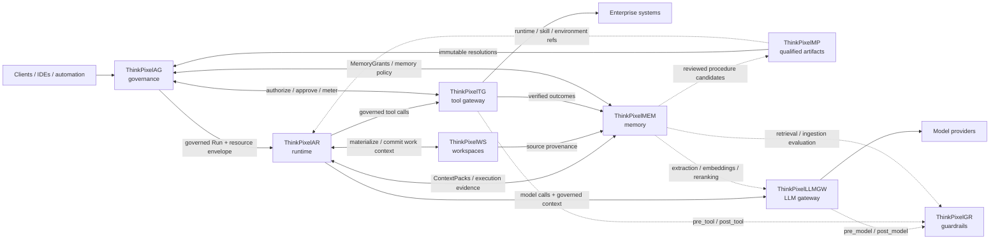

# ThinkPixelGR

**ThinkPixelGR** is a policy-driven guardrails evaluator for LLM applications,
agents, gateways, tool flows, retrieval, and ingestion. It resolves versioned
policies, runs deterministic or pluggable detectors, and returns findings,
optional transformations, and decisions for the caller to enforce.

> ThinkPixelGR is an evaluator, not an LLM proxy or an authorization service. An
> `allow` decision never grants Run, model, tool, Workspace, or memory authority.

## Status

The initial runnable Go vertical slice loads YAML policies and profiles,
resolves mandatory and selected policies, and runs the Phase 1 deterministic
detectors: regex, keywords, request limits, allow/deny lists, JSON Schema, and
structured secret detection. It supports `allow`, `block`, `redact`, and `monitor`.
The versioned remote-detector wire contract and conformance tests are published;
policy and detector deadlines now enforce explicit fail-open, fail-closed, or
monitor-on-failure behavior. Bearer-authenticated callers are bound to explicit
tenant and API scopes. Content-safe JSON audit events, Prometheus metrics, and
W3C-correlated trace spans are available through a replaceable observability
port. Remote adapters, live configuration reload, and production deployment
remain planned work.

See the [documentation index](docs/README.md), [implementation ledger](TODO.md),
and [implementation plan](PLAN.md) for authoritative detail.

## Quick start

Prerequisites: Go 1.24 or Docker.

```bash
make verify
export THINKPIXELGR_DEMO_TOKEN="$(openssl rand -hex 32)"
make run
```

In another terminal, evaluate a request using the included `demo` tenant and
`baseline@1` profile:

```bash
curl --fail-with-body http://localhost:8080/v1/evaluations \
  -H "Authorization: Bearer ${THINKPIXELGR_DEMO_TOKEN}" \
  -H 'Content-Type: application/json' \
  -d '{
    "request_id": "req_demo",
    "stage": "pre_model",
    "tenant_id": "demo",
    "guardrails": {"profile": "baseline@1"},
    "content": {
      "messages": [{
        "role": "user",
        "content": "Contact person@example.com"
      }]
    }
  }'
```

The response redacts the email address. Include “ignore previous instructions”
to exercise the blocking path. With the same environment variable set, run the
containerized service with `docker compose up --build`.

## Key concepts

- Detectors report findings; policies turn findings into decisions; callers
  enforce decisions.
- Platform- and tenant-mandatory policies cannot be removed by caller-selected
  profiles or policies.
- Policies, profiles, detectors, and the public API are explicitly versioned.
- The Go service owns orchestration and deterministic checks. Specialized
  detector runtimes remain replaceable external services.
- ThinkPixelGR does not persist raw evaluated content in the current slice.
- Audit, metric, and trace output excludes raw content and credentials by
  default; metrics require an independent authenticated capability.

The canonical API is [`api/openapi.yaml`](api/openapi.yaml), example policy
configuration is [`configs/config.yaml`](configs/config.yaml), and repository
ownership boundaries are defined in [`ALIGNMENT.md`](ALIGNMENT.md).

## Contributing

Use `make verify` as the aggregate local verification gate. Please keep public
API changes synchronized with the OpenAPI contract, compatibility notes,
documentation, and tests. Follow [`AGENTS.md`](AGENTS.md) for repository rules.

## ThinkPixel platform

This project is part of the **ThinkPixel** family: a modular, vendor-neutral set of components for building governed enterprise AI-agent platforms.

Each component is independently useful. The complete platform is a composition of replaceable services connected through versioned contracts; no component requires the full stack in order to be deployed.

| Component | Role |
|---|---|
| [ThinkPixelAG](https://github.com/bdobrica/ThinkPixelAG) | Agent governance and lifecycle control plane: agent/run authority, policy decisions, resource envelopes, approvals, revocation, and trusted governance state. |
| [ThinkPixelAR](https://github.com/bdobrica/ThinkPixelAR) | Agent runtime: durable Sessions, isolated/disposable execution, harness adaptation, recovery, and runtime events. |
| [ThinkPixelWS](https://github.com/bdobrica/ThinkPixelWS) | Durable roaming Workspaces: persistent work context, immutable generations, materializations, snapshots, forks, and source provenance. |
| [ThinkPixelMEM](https://github.com/bdobrica/ThinkPixelMEM) | Long-term agent memory: governed learned context, provenance, temporal revisions, retrieval, correction, and forgetting. |
| [ThinkPixelMP](https://github.com/bdobrica/ThinkPixelMP) | Marketplace and software supply-chain plane for Skills, runtimes, MCP servers, agent bundles, and other immutable agentic artifacts. |
| [ThinkPixelTG](https://github.com/bdobrica/ThinkPixelTG) | Tool gateway and policy-enforcement point for governed tool calls, downstream credentials, side effects, idempotency, and tool evidence. |
| [ThinkPixelLLMGW](https://github.com/bdobrica/ThinkPixelLLMGW) | LLM gateway for provider abstraction, model routing, credentials, budgets, accounting, and model-access policy enforcement. |
| [ThinkPixelGR](https://github.com/bdobrica/ThinkPixelGR) | Guardrails evaluator for model, tool, retrieval, and ingestion content. It returns findings/decisions; the calling gateway or service enforces them. |

### Intended composition



The diagram describes the **target integration model**, not a claim that every edge is implemented in every current release.

### Integration rules

The platform follows a few cross-component rules:

- **Authority does not emerge from content.** Marketplace metadata, Skills, Workspace membership, retrieved memory, model output, or a guardrail `allow` decision cannot grant permissions that the governed Run does not already have.
- **State has one authoritative owner.** Components exchange references and versioned messages; they do not read or write another component's database directly.
- **Integrations are adapters, not domain dependencies.** A ThinkPixel integration should be configurable and replaceable with a contract-compatible alternative.
- **Cross-component identity is explicit.** Where relevant, requests should carry stable governed context such as tenant, principal, agent, Run, Session/Workspace references, immutable artifact digests, and trace context.
- **Public integration contracts are versioned.** OpenAPI/JSON Schema/protobuf or another explicit wire contract is preferred over importing another repository's internal types.
- **Vendor-specific behavior stays behind adapters.** Model providers, agent harnesses, storage systems, registries, policy engines, and execution substrates must not become platform-wide domain contracts.

### Planned integration points

| Integration | Intended contract |
|---|---|
| **AG → AR** | AG admits a Run and supplies its authority/resource context; AR executes it and must not enlarge that authority. Revocation, lease, and fencing state flow back into runtime enforcement. |
| **MP → AG / AR / WS** | MP resolves qualified artifacts to immutable identities/digests. AG decides whether they may be used; AR/WS consume the resolved runtime, Skill, or environment references. Qualification is not authorization. |
| **AR ↔ WS** | AR materializes a durable Workspace generation into disposable execution and returns committed/checkpointed work to WS. Session identity remains owned by AR; Workspace identity remains owned by WS. |
| **AR → LLMGW** | Agent model calls go through LLMGW with governed Run/tenant context. Provider credentials and provider-specific routing stay outside the harness. |
| **LLMGW ↔ GR** | LLMGW will support an optional configured GR endpoint/profile mapping. It invokes `pre_model` before provider dispatch and `post_model` before releasing model output, then enforces GR's decision/transformation. GR remains optional and replaceable; its wire API is the contract. |
| **AR → TG** | Harness tool calls cross TG rather than reaching governed enterprise systems directly. TG owns credential brokerage, idempotency/side-effect handling, and trusted tool evidence. |
| **TG ↔ AG** | TG asks AG (or a contract-compatible authorizer) whether the current governed Run may perform the exact operation and obtains action-scoped approval when required. TG returns trusted metering/evidence. |
| **TG ↔ GR** | TG invokes `pre_tool` and `post_tool` evaluation when configured and enforces the result. A GR allow never overrides an AG authorization denial. |
| **AR / WS / TG → MEM** | Execution history, Workspace provenance, and verified tool outcomes may become evidence for learned memory. MEM does not become the source of truth for those upstream systems. |
| **AG ↔ MEM** | AG supplies Run-scoped memory authority (for example MemoryGrants); MEM enforces it for reads/writes and returns structured ContextPacks. |
| **MEM ↔ LLMGW / GR** | MEM may use LLMGW for extraction/embedding/reranking and GR for ingestion/retrieval inspection while keeping canonical memory state independent from either service. |
| **MEM → MP** | Learned procedure candidates may be reviewed and promoted through MP into qualified reusable Skills; learning does not silently become trusted executable behavior. |

Project-specific implementation status, supported versions, and release qualification belong in each project's own documentation.

## License

Licensed under the terms in [LICENSE](LICENSE).
