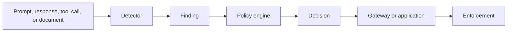
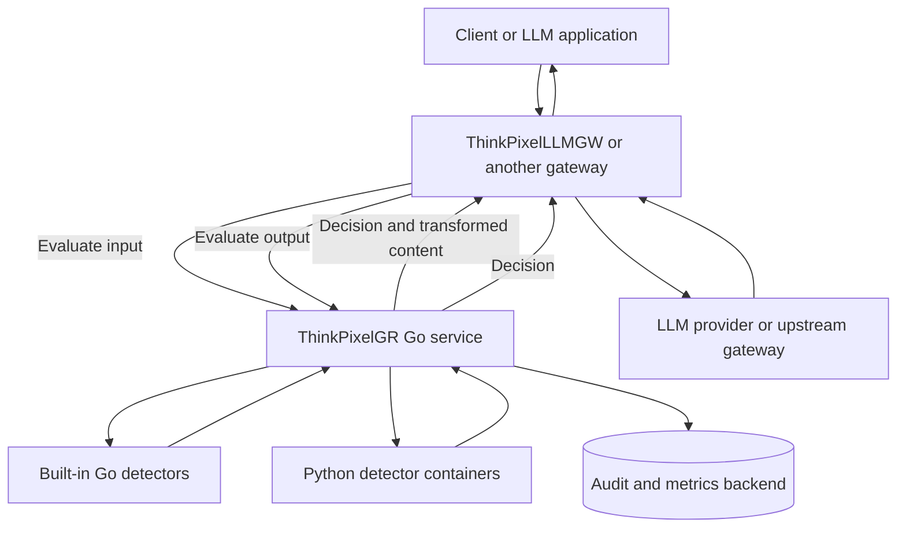
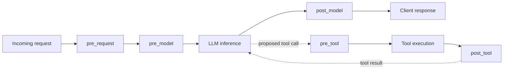
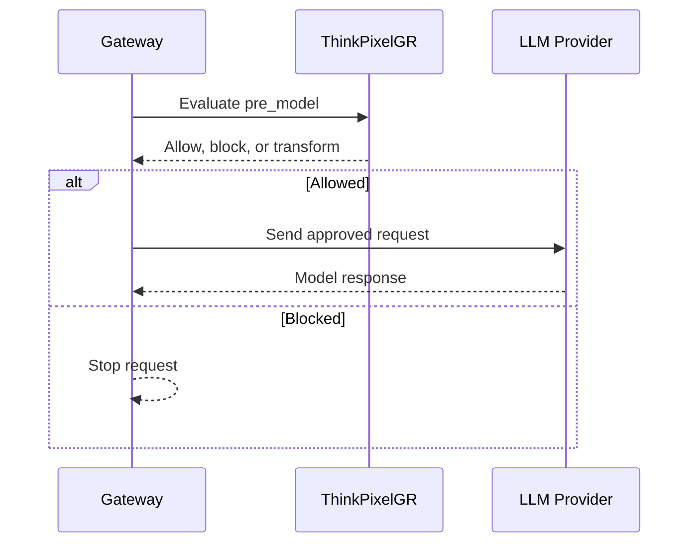
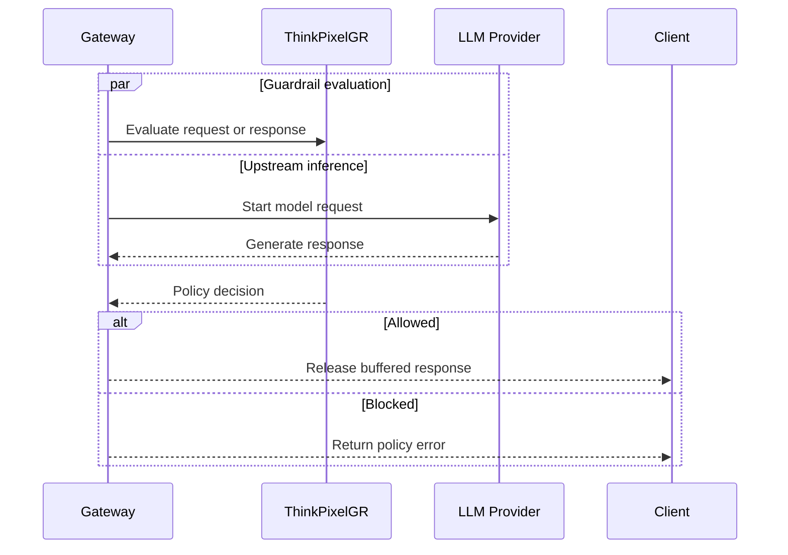
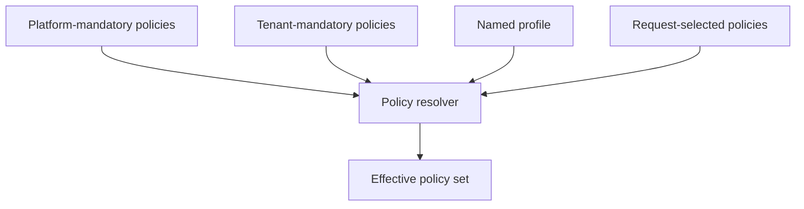
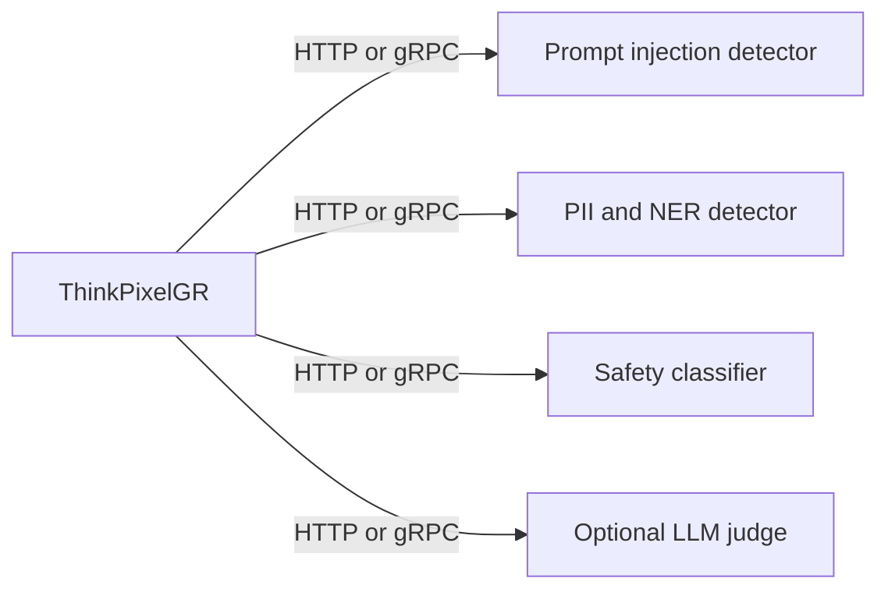
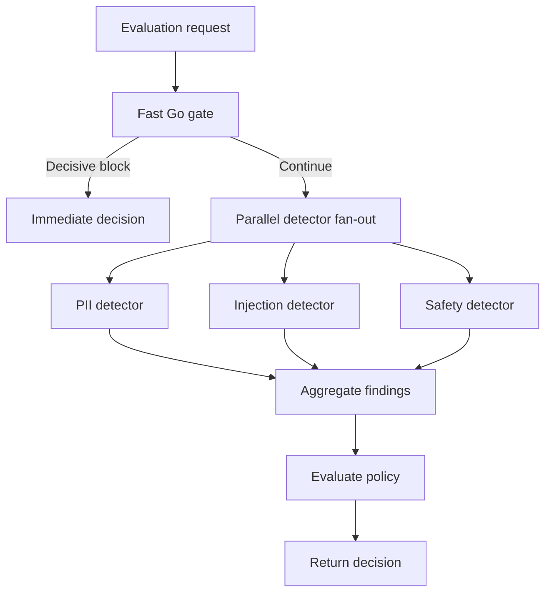
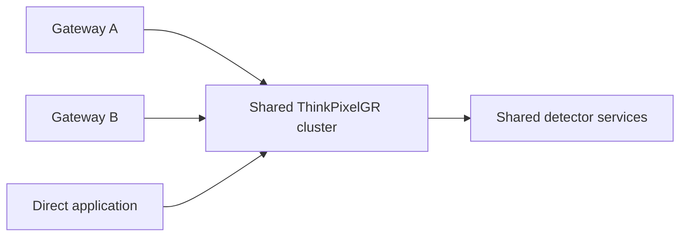
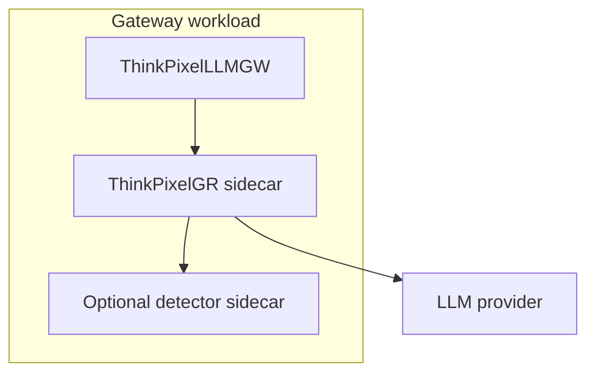

# ThinkPixelGR

**ThinkPixelGR** is a policy-driven guardrails service for LLM applications, agents, and gateways.

It provides a reusable control plane for inspecting prompts, model responses, tool calls, retrieved content, and ingestion payloads. The main service is written in **Go** and includes fast deterministic checks, while specialized machine-learning detectors run as independent **Python containers**.

ThinkPixelGR is designed to work alongside projects such as **ThinkPixelLLMGW**, but it can also be integrated directly into any application that calls an LLM provider or another gateway.

> ThinkPixelGR is an evaluator, not an LLM proxy. It produces findings, transformations, and policy decisions; the calling gateway or application enforces them.

## Status

ThinkPixelGR now has an initial runnable Go vertical slice. It loads versioned
policies and profiles from YAML, resolves mandatory and selected policies, and
evaluates text with built-in regex and keyword detectors. The current slice
supports `allow`, `block`, `redact`, and `monitor` decisions.

The architecture and proposed delivery plan are documented in [`PLAN.md`](./PLAN.md).

## Quick Start

Prerequisites: Go 1.24 or Docker.

```bash
make test
make run
```

In another terminal, evaluate a request using the included `demo` tenant and
`baseline@1` profile:

```bash
curl --fail-with-body http://localhost:8080/v1/evaluations \
  -H 'Content-Type: application/json' \
  -d '{
    "request_id": "req_demo",
    "stage": "pre_model",
    "tenant_id": "demo",
    "guardrails": {"profile": "baseline@1"},
    "content": {
      "messages": [{
        "role": "user",
        "content": "Contact person@example.com"
      }]
    }
  }'
```

The response includes a `redact` decision and content containing
`<EMAIL_ADDRESS>`. Platform policy `platform/secrets@1` is applied even when a
caller does not select it. To exercise the blocking path, include “ignore
previous instructions” in the message.

Run the containerized service with `docker compose up --build`. The canonical
API draft is in [`api/openapi.yaml`](./api/openapi.yaml), and the example policy
configuration is in [`configs/config.yaml`](./configs/config.yaml).

### Current boundaries

This bootstrap intentionally implements the deterministic core of Phase 1.
Remote Python detectors, authentication, live configuration reload, metrics,
tracing, and production deployment manifests remain roadmap work. Configuration
is validated once at startup and the service does not persist raw content.

## Why ThinkPixelGR?

LLM guardrails are not one filter or one classifier. Different risks require different controls:

- Regex and deterministic rules for secrets, identifiers, keywords, and request limits.
- Named-entity recognition for personal or regulated information.
- Specialized classifiers for prompt injection, jailbreaks, toxicity, and unsafe content.
- JSON Schema validation for structured outputs and tool arguments.
- Optional LLM-based judges for complex, application-specific policies.
- Tenant, platform, and request-level policy enforcement.

ThinkPixelGR combines these controls behind one versioned policy API.

## Design Principles

### Separate detection, policy, and enforcement

A detector reports what it found. A policy determines what that finding means. The caller performs the resulting action.



For example:

1. A detector identifies an email address.
2. A tenant policy says email addresses must be redacted before model inference.
3. ThinkPixelGR returns the transformed content and a `redact` decision.
4. The gateway sends the transformed request to the model.

### Keep the Go core lightweight

The Go service owns orchestration, policy resolution, deterministic checks, concurrency, redaction, audit events, and observability.

Python services own model-backed detection and can use the most appropriate ML runtime without embedding Python into the Go process.

### Make every policy explicit and versioned

Policies and profiles should have stable identifiers such as:

```text
platform/secrets@v1
tenant-123/pii-production@v4
profiles/customer-support@v2
```

This makes decisions reproducible, auditable, and safer to evolve.

## Architecture



The gateway remains responsible for:

- Provider integrations and authentication.
- Routing, retries, and fallback models.
- Streaming and token accounting.
- Quotas, budgets, and billing.
- Enforcing the decision returned by ThinkPixelGR.

ThinkPixelGR remains responsible for:

- Resolving effective policies.
- Running local and remote detectors.
- Aggregating findings.
- Producing decisions.
- Redacting or transforming content.
- Recording policy versions, timings, and audit evidence.

## Request Lifecycle

ThinkPixelGR can evaluate multiple stages of an LLM workflow:



Supported stages are expected to include:

| Stage | Purpose |
|---|---|
| `pre_request` | Validate request metadata, model access, limits, and operational policy. |
| `pre_model` | Inspect prompts and messages before provider exposure. |
| `post_model` | Inspect model output before it reaches the client. |
| `pre_tool` | Validate a proposed tool call and its arguments. |
| `post_tool` | Inspect tool results before returning them to the model. |
| `pre_retrieval` | Validate retrieval queries and permitted data sources. |
| `post_retrieval` | Inspect retrieved content before adding it to context. |
| `ingestion` | Inspect documents before indexing or storage. |

## Execution Modes

Each policy declares how it participates in execution.

### Blocking

The guardrail must finish before the protected operation begins.



Use blocking execution when the upstream provider must not receive unsafe or sensitive content.

Typical examples include secrets, regulated PII, provider restrictions, tool authorization, and mandatory request validation.

### Speculative

Detection and model inference run concurrently, but output is not released until required policies finish.



Speculative execution improves latency, but it does **not** prevent the provider from seeing the input. It may also incur generation cost for a request that is later rejected.

### Observational

The policy records findings without changing the current request.

This is useful for:

- Shadow-testing a new detector.
- Calibrating thresholds.
- Measuring false positives.
- Comparing detector versions.
- Gathering production metrics before enforcement.

## Policy Resolution

Clients may select profiles or individual policies, while operators can enforce mandatory controls.



Conceptually:

```text
effective policies =
    platform mandatory
  + tenant mandatory
  + selected profile
  + request-selected policies
```

A caller may opt into application-specific moderation, but it cannot disable mandatory platform or tenant protections.

## Example API

### Evaluate content

```http
POST /v1/evaluate
Content-Type: application/json
Authorization: Bearer <token>
```

```json
{
  "request_id": "req_01J...",
  "stage": "pre_model",
  "tenant_id": "tenant-123",
  "model": "openai/gpt-5",
  "guardrails": {
    "profile": "customer-support-production",
    "policies": [
      "detect-secrets",
      "block-prompt-injection"
    ]
  },
  "content": {
    "type": "chat_messages",
    "messages": [
      {
        "role": "user",
        "content": "Please summarize this account record."
      }
    ]
  },
  "metadata": {
    "gateway": "ThinkPixelLLMGW"
  }
}
```

Example response:

```json
{
  "request_id": "req_01J...",
  "decision": "redact",
  "allowed": true,
  "applied_policies": [
    "platform/secrets@v1",
    "tenant-123/customer-support-production@v3"
  ],
  "findings": [
    {
      "detector": "builtin/pii-regex@v1",
      "category": "pii.email",
      "confidence": 1.0,
      "location": "content.messages[0].content",
      "start": 18,
      "end": 36
    }
  ],
  "transformed_content": {
    "type": "chat_messages",
    "messages": [
      {
        "role": "user",
        "content": "Contact <EMAIL_ADDRESS> about the account."
      }
    ]
  },
  "timing_ms": {
    "total": 7,
    "policy_resolution": 1,
    "detectors": 5
  }
}
```

## Decision Model

Expected decisions include:

| Decision | Meaning |
|---|---|
| `allow` | Continue without changing the content. |
| `block` | Stop the guarded operation. |
| `redact` | Continue using sanitized content. |
| `rewrite` | Continue using policy-approved transformed content. |
| `monitor` | Record the finding without affecting the request. |
| `require_review` | Stop automated processing and request external review. |

## Built-in Go Detectors

The initial Go service is expected to include:

- Regex matching.
- Keyword and phrase matching.
- Allowlist and denylist checks.
- Request, message, and content-size limits.
- JSON Schema validation.
- Common secret-pattern detection.
- Structured PII detection for values such as email addresses, phone numbers, and payment identifiers.
- Model, provider, tool, and domain restrictions.

These checks are fast, deterministic, explainable, and suitable for the first gate in an evaluation pipeline.

## Python Detector Containers

Specialized detectors run as independent services and implement a stable ThinkPixelGR detector contract.

Candidate detector types include:

- Prompt-injection and jailbreak classifiers.
- PII and named-entity recognition.
- Toxicity and content-safety classifiers.
- Domain-specific policy classifiers.
- Language-specific detectors.
- Optional LLM-as-judge services.



A detector should return findings rather than enforcement decisions:

```json
{
  "detector": "prompt-injection-classifier",
  "version": "1.2.0",
  "findings": [
    {
      "category": "prompt_injection",
      "confidence": 0.94,
      "location": "content.messages[2].content"
    }
  ],
  "timing_ms": 23
}
```

The ThinkPixelGR policy engine decides whether that result should block, redact, rewrite, or only be recorded.

## Detector Execution

Independent detectors can run concurrently after the fast local gate succeeds.



The orchestrator should support:

- Per-detector deadlines.
- Cancellation through Go contexts.
- Bounded concurrency.
- Short-circuiting on decisive findings.
- Circuit breakers.
- Configurable retries.
- Fail-open, fail-closed, and monitor-on-failure behavior.
- Detector health and readiness checks.

## Example Policy Configuration

```yaml
policies:
  detect-secrets:
    version: 1
    stages: [pre_model, post_tool, ingestion]
    execution: blocking
    detector: builtin/secrets
    action: redact
    on_failure: fail_closed

  block-prompt-injection:
    version: 2
    stages: [pre_model, post_retrieval]
    execution: speculative
    detector: python/prompt-injection
    threshold: 0.88
    action: block
    on_failure: fail_open

  observe-output-safety:
    version: 1
    stages: [post_model]
    execution: observational
    detector: python/content-safety
    action: monitor
    on_failure: monitor

profiles:
  customer-support-production:
    policies:
      - detect-secrets
      - redact-customer-pii
      - block-prompt-injection
      - enforce-output-schema
```

## Deployment Models

### Shared service



This model centralizes policy management and allows expensive detector models to be pooled.

### Sidecar



A sidecar reduces network distance and can provide stronger workload or tenant isolation.

The same API and policy semantics should work in both modes.

## Streaming

Input guardrails can be evaluated before starting inference or speculatively alongside it.

For output guardrails, the gateway must choose an enforcement strategy:

- Buffer the complete response before releasing it.
- Buffer only until required detectors return.
- Evaluate chunks incrementally when a detector supports streaming.
- Cancel the provider request when a decisive block occurs.

ThinkPixelGR should explicitly return whether a decision is final and whether additional evaluation is required before output can be released.

## Security and Privacy

ThinkPixelGR may process highly sensitive prompts and model responses. Production deployments should provide:

- TLS for every service-to-service connection.
- Authentication between gateways, ThinkPixelGR, and detector containers.
- Tenant-aware authorization.
- Minimal content retention by default.
- Content-free operational logs where possible.
- Configurable hashing or redaction of audit evidence.
- Network policies restricting detector egress.
- Read-only container filesystems where practical.
- Signed or pinned detector images.
- Explicit model and policy version reporting.

Remote detector services should receive only the content required for their task.

## Observability

ThinkPixelGR should expose metrics and traces for:

- Total evaluation latency.
- Policy-resolution latency.
- Detector latency by name and version.
- Detector timeout and failure counts.
- Findings by category.
- Decisions by action and policy.
- Redaction counts.
- Circuit-breaker state.
- Requests by stage, tenant, and profile.
- Speculative requests discarded after upstream work began.

OpenTelemetry should be used for distributed traces across the gateway, ThinkPixelGR, and detector containers.

Audit events should record policy and detector versions without storing raw content by default.

## Reliability Behavior

Every remote detector policy must define what happens when the detector is unavailable:

- `fail_closed`: reject the guarded operation.
- `fail_open`: continue without that detector result.
- `monitor`: continue and record the detector failure.

The correct choice depends on the protected risk. Credential leakage may require `fail_closed`; an experimental toxicity detector may use `monitor`.

## Suggested Repository Layout

- `cmd/thinkpixelgr/` — service entry point.
- `internal/api/` — HTTP handlers, middleware, and transport types.
- `internal/audit/` — structured audit-event generation.
- `internal/config/` — service and detector configuration.
- `internal/detector/builtin/` — deterministic Go detectors.
- `internal/detector/remote/` — clients for Python detector services.
- `internal/engine/` — evaluation orchestration and concurrency.
- `internal/policy/` — policy loading, compilation, resolution, and decision logic.
- `internal/redact/` — content transformations and location-aware redaction.
- `internal/telemetry/` — metrics and OpenTelemetry integration.
- `internal/tenancy/` — tenant identity and authorization.
- `pkg/detectorcontract/` — reusable detector protocol types.
- `detectors/` — reference Python detector containers.
- `configs/policies/` — built-in and example policies.
- `configs/profiles/` — named policy bundles.
- `api/` — OpenAPI specifications.
- `deployments/` — Docker Compose, Kubernetes, and Helm assets.
- `docs/adr/` — architecture decision records.
- `PLAN.md` — detailed implementation plan.
- `README.md` — project overview and usage documentation.

## Initial Delivery Scope

The first useful release should include:

1. A Go HTTP service with `/v1/evaluate`, health, readiness, and policy-inspection endpoints.
2. Versioned policy and profile configuration loaded from YAML.
3. Built-in regex, keyword, size-limit, allowlist, JSON Schema, and secret detectors.
4. Policy resolution across platform, tenant, profile, and request scopes.
5. Decisions for `allow`, `block`, `redact`, and `monitor`.
6. A stable HTTP contract for Python detector containers.
7. Parallel remote-detector execution with deadlines and cancellation.
8. Structured audit events, Prometheus metrics, and OpenTelemetry traces.
9. A reference Python prompt-injection detector container.
10. Docker Compose examples integrating ThinkPixelGR with ThinkPixelLLMGW.

See [`PLAN.md`](./PLAN.md) for the complete phased implementation plan.

## Non-Goals

ThinkPixelGR does not claim to completely solve prompt injection, jailbreaks, hallucination, or unsafe agent behavior.

It is not a replacement for:

- Application authorization.
- Least-privilege tool credentials.
- Sandboxed execution.
- Provider-level security controls.
- Human review for high-risk workflows.
- Secure application and infrastructure design.

Guardrails should be treated as one layer in a defense-in-depth architecture.

## Roadmap

- [ ] Finalize API, detector, policy, and finding schemas.
- [ ] Build the Go evaluation service.
- [ ] Add built-in deterministic detectors.
- [ ] Add policy compilation and versioning.
- [ ] Implement the remote detector protocol.
- [ ] Publish reference Python detector containers.
- [ ] Add parallel and speculative execution.
- [ ] Add streaming-aware output evaluation.
- [ ] Add production observability and audit support.
- [ ] Add Kubernetes and Helm deployments.
- [ ] Integrate with ThinkPixelLLMGW.

## Contributing

The contribution workflow, development environment, coding standards, and detector certification process will be documented as the implementation stabilizes.

Planned contribution areas include:

- Go detectors.
- Python detector containers.
- Policy bundles.
- Benchmark and adversarial datasets.
- Deployment manifests.
- Gateway integrations.
- Documentation and examples.

## License

A license has not yet been selected.

Before accepting external contributions or publishing production releases, add a `LICENSE` file and update this section with the chosen license.
